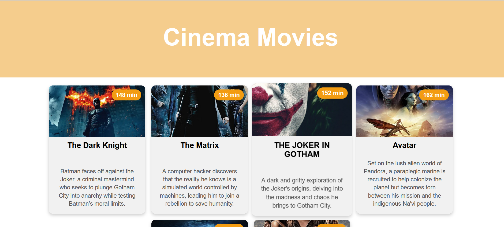

# Django Movies App

## Project Overview
The **Django Movies App** is a simple web application built using the Django framework. It displays a list of movies retrieved from a database, leveraging Django's **MVT (Model-View-Template) architecture**. This project demonstrates **ORM (Object-Relational Mapping), Jinja templating, static file handling, and database management**.



## Features
- Displays a list of movies stored in a database.
- Uses Django ORM to interact with the database.
- Implements the MVT pattern to separate concerns.
- Uses Jinja2 templating to render dynamic content.
- Handles static files like CSS and images.
- Responsive design with basic styling.

## Technologies Used
- **Python**
- **Django**
- **SQLite** (or any preferred database)
- **HTML, CSS**
- **Bootstrap (for styling, optional)**

## Installation & Setup

### Prerequisites
Ensure you have **Python** and **Django** installed. It's recommended to create a virtual environment:

```sh
python -m venv venv
source venv/bin/activate  # On macOS/Linux
venv\Scripts\activate  # On Windows
```

Install dependencies:
```sh
pip install -r requirements.txt
```

### Clone the Repository
```sh
git clone https://github.com/RawanFarakhnah/movies_project.git
cd django-movies-app
```

### Run Migrations
```sh
python manage.py migrate
```

### Create a Superuser (Optional, for Admin Panel)
```sh
python manage.py createsuperuser
```

### Run the Development Server
```sh
python manage.py runserver
```
Then, open `http://127.0.0.1:8000/` in your browser.

---

## Understanding MVT (Model-View-Template)
Django follows the **MVT architecture**:
- **Model (M)**: Represents the database structure.
- **View (V)**: Handles business logic and retrieves data.
- **Template (T)**: Displays data in a structured format.

### Models (Database Interaction - ORM)
The `Movie` model is defined in `models.py`:
```python
from django.db import models

class Movie(models.Model):
    title = models.CharField(max_length=200)
    description = models.TextField()
    duration = models.IntegerField()
    url = models.URLField()
```
Django ORM allows querying data easily:
```python
Movie.objects.all()  # Retrieve all movies
```

### Views (Handling Requests)
Defined in `views.py`:
```python
from django.shortcuts import render
from .models import Movie

def root(request):
    context = {'movies': Movie.objects.all()}
    return render(request, 'index.html', context)
```

### Templates (Jinja Templating)
Django uses Jinja2 templating:
```html

  <div>
    <h2>{{ movie.title }}</h2>
    <p>{{ movie.description }}</p>
    
  </div>

```

---

## Static Files (CSS & Images)
Static files are stored in `static/` and loaded using:
```html

<link rel="stylesheet" href="">
```

## Contributing
Feel free to **fork** this project, improve it, and submit a **pull request**.

---

Made with ❤️ using Django!
